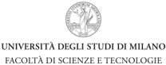

## Università degli Studi di Milano

FACOLTÀ DI SCIENZE E TECNOLOGIE Corso di Laurea in Fisica

Tesi di laurea magistrale

Elaborazione di un dataset degli estremi di temperatura mensili per il territorio italiano

Candidato: Davide Nicoli Matricola 980508

Relatore: Prof. Maurizio Maugeri Correlatori: Dr. Michele Brunetti Dr.ssa Veronica Manara